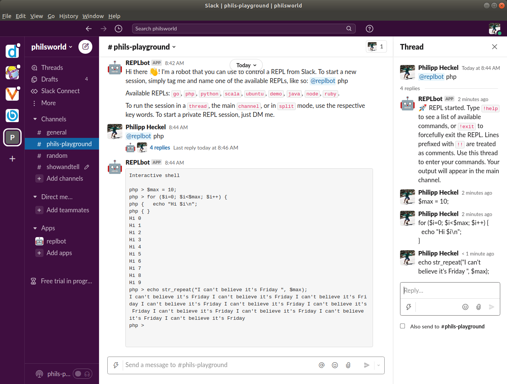

# 🤖 REPLbot
REPLbot is a Slack bot that allows you to control a [REPL](https://en.m.wikipedia.org/wiki/Read%E2%80%93eval%E2%80%93print_loop) from within Slack. It comes with a few REPLs (Go 🥳, Java, 
NodeJS, PHP, Python, Ruby, Scala, Kotlin, C++ and Ubuntu/Bash), but you can easily make/bring your own.



## Why ...?
I thought it might be a fun way to collaboratively dabble with a REPL in a team. Yes, I could have gone for a terminal 
in a browser, but there's nothing like having it right there in Slack. Mainly I did it because it was fun though. 😄

## How it works
I use `tmux` and the `tmux capture-pane` command to run most of the show. It's simple, but effective. In the first 
iteration I tried using a pseudo terminal (pty) directly, but with all the escape sequences and commands, it was getting
kinda tiresome, and I was spending time with stuff that I didn't want to spend time with (though I learned a lot!). 
And `tmux` does its job so well. 

The actual REPLs are just simple scripts (see [script.d folder](config/script.d)), so they could be anything you like. 
I highly recommend using Docker to provide somewhat of an isolation, though you'll probably still need to trust the
people using the bot if you give them an entire REPL.

## Installation
Install steps:

1. Make sure `tmux` and probably also `docker` are installed. Then install REPLbot using any of the methods below. 
2. Then edit `/etc/replbot/config.yml` to add Slack bot token. The config also explains how to create a Slack app and acquire this token.
3. Review the scripts in `/etc/replbot/script.d`, and make sure that you have Docker installed if you'd like to use them.
4. If you're running REPLbot as non-root user (such as when you install the deb/rpm), be sure to add the `replbot` user to the `docker` group: `sudo usermod -G docker -a replbot`.
5. Then just run it with `replbot` (or `systemctl start replbot` when using the deb/rpm).

**Debian/Ubuntu** (*from a repository*)**:**
```bash
curl -sSL https://archive.heckel.io/apt/pubkey.txt | sudo apt-key add -
sudo apt install apt-transport-https
sudo sh -c "echo 'deb [arch=amd64] https://archive.heckel.io/apt debian main' > /etc/apt/sources.list.d/archive.heckel.io.list"  
sudo apt update
sudo apt install replbot
```

**Debian/Ubuntu** (*manual install*)**:**
```bash
sudo apt install tmux
wget https://github.com/binwiederhier/replbot/releases/download/v0.1.1/replbot_0.1.1_amd64.deb
dpkg -i replbot_0.1.1_amd64.deb
```

**Fedora/RHEL/CentOS:**
```bash
# Make sure that "tmux" is installed
rpm -ivh https://github.com/binwiederhier/replbot/releases/download/v0.1.1/replbot_0.1.1_amd64.rpm
```

**Docker:**   
You can configure the Docker image by mounting a config directory (containing [config.yml](config/config.yml)) to 
`/etc/replbot`. To be able to use most of the pre-packaged [script.d](config/script.d) REPLs (to be mounted to `/etc/replbot/script.d`), 
you'll need to give the REPLbot image access to the Docker socket file. This allows the container to spin up other containers 
on the host. This is a security risk and considered bad practice, but it's the only way.

```bash
docker run --rm -it \
  -v /etc/replbot:/etc/replbot \
  -v /var/run/docker.sock:/var/run/docker.sock \
  binwiederhier/replbot
```

**Go:**
```bash
# Be sure "tmux" is installed
go get -u heckel.io/replbot
```

**Manual install** (*any x86_64-based Linux*)**:**
```bash
# Make sure that "tmux" is installed
wget https://github.com/binwiederhier/replbot/releases/download/v0.1.1/replbot_0.1.1_linux_x86_64.tar.gz
sudo tar -C /usr/bin -zxf replbot_0.1.1_linux_x86_64.tar.gz replbot
```

## Contributing
I welcome any and all contributions. Just create a PR or an issue, or talk to me [on Slack](https://gophers.slack.com/archives/C02ABHKDCN7).

## License
Made with ❤️ by [Philipp C. Heckel](https://heckel.io), distributed under the [Apache License 2.0](LICENSE).
