# 🤖 REPLbot
[](https://github.com/binwiederhier/replbot/releases/latest)
[](https://pkg.go.dev/heckel.io/replbot)
[](https://github.com/binwiederhier/replbot/actions)
[](https://goreportcard.com/report/github.com/binwiederhier/replbot)
[](https://codecov.io/gh/binwiederhier/replbot)
[](https://gophers.slack.com/archives/C02ABHKDCN7)

REPLbot is a bot for Slack and Discord that allows you to control a [REPL](https://en.m.wikipedia.org/wiki/Read%E2%80%93eval%E2%80%93print_loop) 
or shell from a chat. It comes with a few REPLs (Go 🥳, Java, NodeJS, PHP, Python, Ruby, Scala, Kotlin, C++, Ubuntu, Debian, Alpine, Arch Linux, Amazon Linux, CentOS & Fedora), 
but you can [easily make or bring your own](config/script.d).

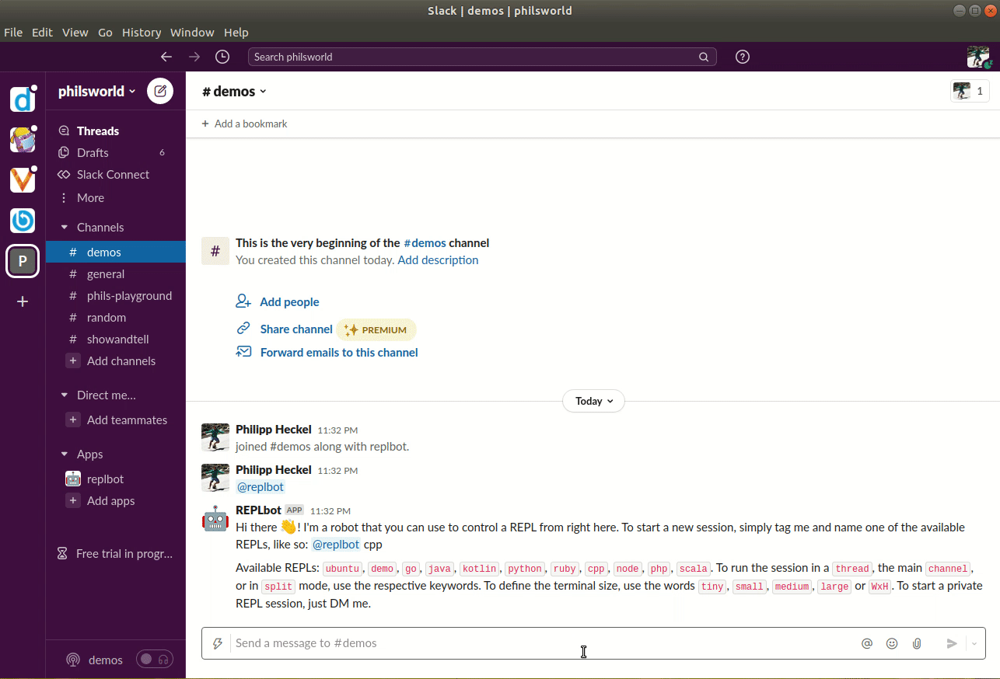

## Why ...?
I thought it might be a fun way to collaboratively dabble with a REPL in a team. Yes, I could have gone for a terminal 
in a browser, but there's nothing like having it right there in Slack. Mainly I did it because it was fun though. 😄

## How it works
I use `tmux` and the `tmux capture-pane` command to run most of the show. It's simple, but effective. In the first 
iteration I tried using a pseudo terminal (pty) directly, but with all the escape sequences and commands, it was getting
kinda tiresome, and I was spending time with stuff that I didn't want to spend time with (though I learned a lot!). 
And `tmux` does its job so well. 

The actual REPLs are just simple scripts (see [script.d folder](config/script.d)), so they could be anything you like. 
I highly recommend using Docker to provide somewhat of an isolation, though you'll probably still need to trust the
people using the bot if you give them an entire REPL.

## Screenshots & Videos

<table>
  <tr>
    <td>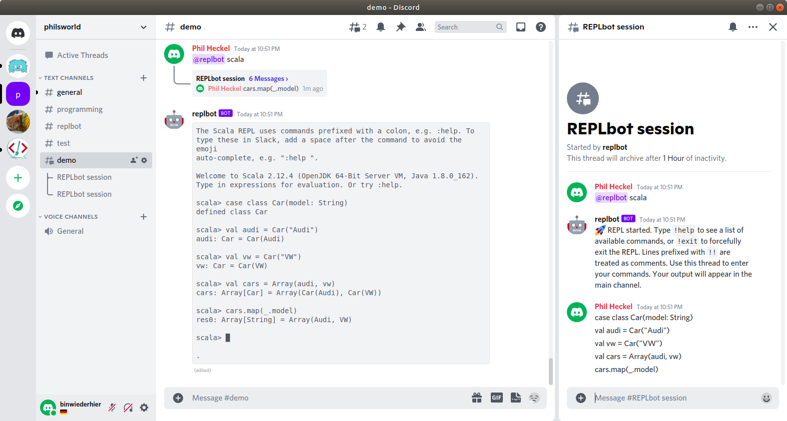</td>
    <td>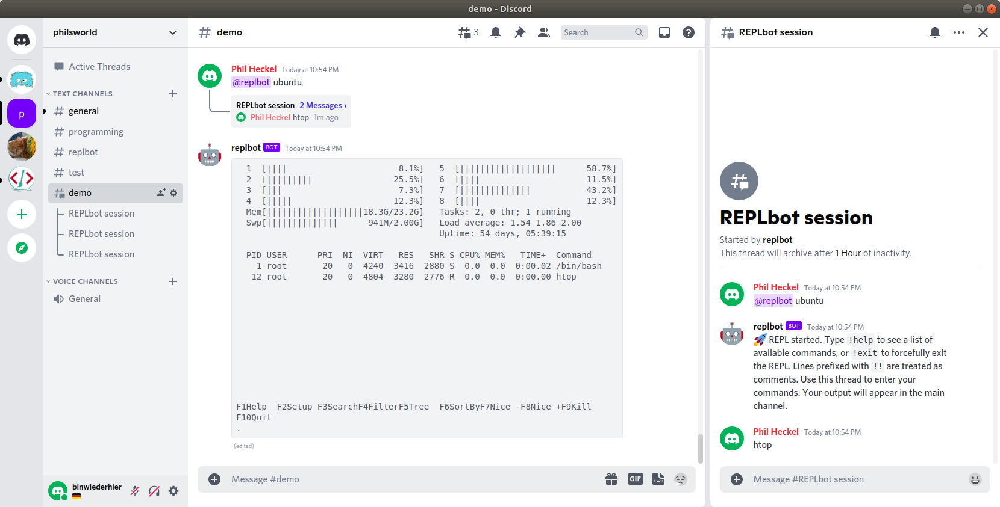</td>
    <td>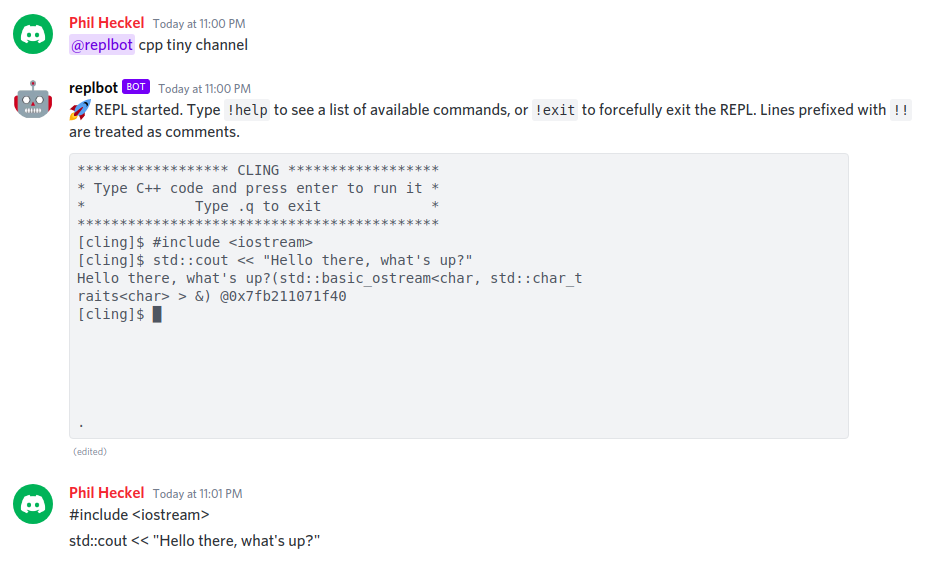</td>
  </tr>
  <tr>
    <td>Scala, split mode (Discord)</td>
    <td>Ubuntu running `htop` (Discord)</td>
    <td>C++, channel mode (Discord)</td>
  </tr>
  <tr>
    <td>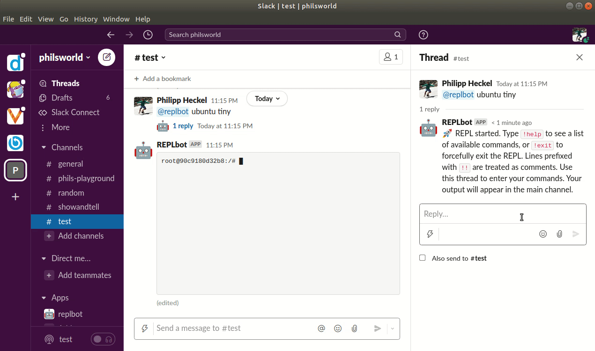</td>    
    <td>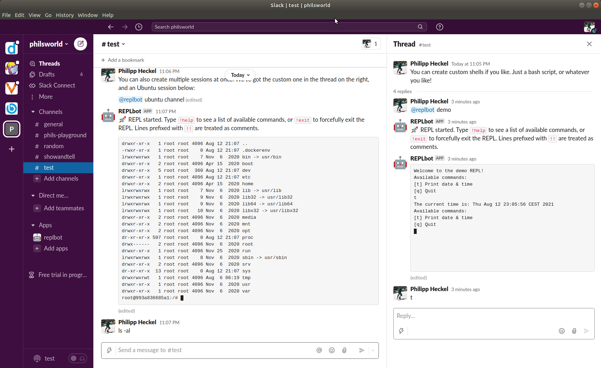</td>
    <td></td>
  </tr>
  <tr>
    <td>Blinking cursors, choo choo 🚂 (Slack)</td>        
    <td>Custom shells, multiple sessions (Slack)</td>
    <td></td>
  </tr>
</table>

## Usage
After [installing REPLbot](#installation), you may use it by tagging `@replbot` in Slack/Discord. For the most part it 
should be pretty self-explanatory:

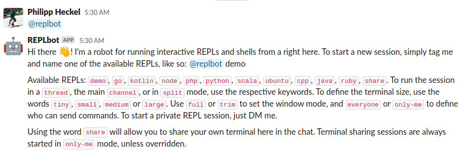

To start a session with the default settings, simply say `@replbot java` to start a Java REPL. There are a few advanced arguments
you can use when starting a session.

### REPL scripts
REPLbot can run more or less arbitrary scripts and interact with them -- they don't really have to be REPLs. Any interactive
script is perfectly fine, whether it's a REPL or a Shell or even a game. By default, REPLbot ships with a [few REPLs](config/script.d). 
To extend the REPLs you can run, simple add more scripts in the `script-dir` folder (see [config.yml](config/config.yml)).

Here's a super simple example script:
```bash
#!/bin/sh
# Scripts are executed as "./script run <id>" to start the REPL, and as "./script kill <id>"
# to stop it. Not all scripts need the "kill" behavior, if they exit properly on SIGTERM.
case "$1" in
  run)
    while true; do
      echo -n "Enter name: "
      read name
      echo "Hello $name!"
    done 
    ;;
  *) ;;
esac
```

In all likelihood, you'll want more isolation by running REPLs as Docker containers. Here's the [PHP REPL script](https://github.com/binwiederhier/replbot/blob/1460ddba1adbfd450465d5d37b0b9b340e8a4f79/config/script.d/php)
that REPLbot ships with (not shortened):

```bash
#!/bin/sh
# REPLbot script to run a PHP REPL.
#
# Scripts are executed as "./script run <id>" to start the REPL,
# and as "./script kill <id>" to stop it.

DIR="$(cd -- "$(dirname "$0")" >/dev/null 2>&1 && pwd -P)"
case "$1" in
  run) docker run --rm --name "$2" -it php ;;
  kill) "$DIR"/helpers/docker-kill "$2" ;;
  *) echo "Syntax: $0 (run|kill) ID"; exit 1 ;;
esac
```

### Control mode
You can specify if you want the session to be started in the main channel (`channel`), in a thread (`thread`),
or in split mode (`split`) using both channel and thread. Split mode is the default because it is the cleanest to use: 
it'll use a thread for command input and the main channel to display the terminal.

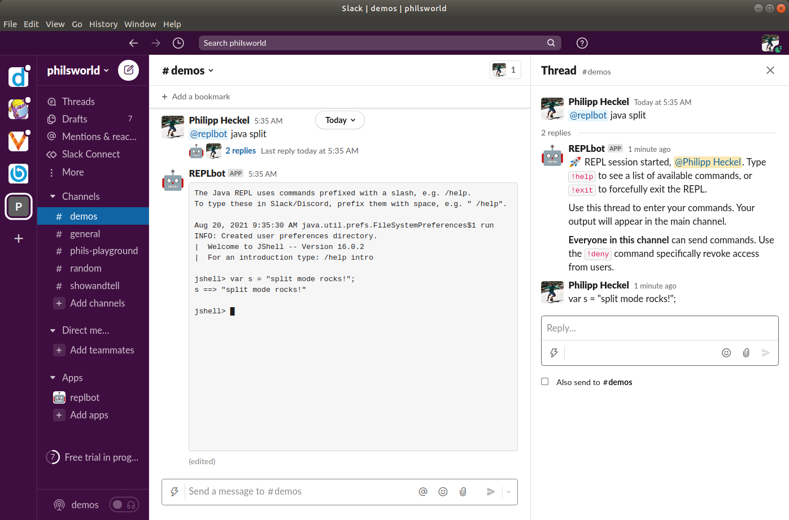

### Terminal size
You can set the terminal window size when you start a session by using the keywords `tiny` (60x15), `small` (80x24), 
`medium` (100x30), and `large` (120x38). The default is `small`. You may also resize the terminal while the session is
running using the `!resize` command.

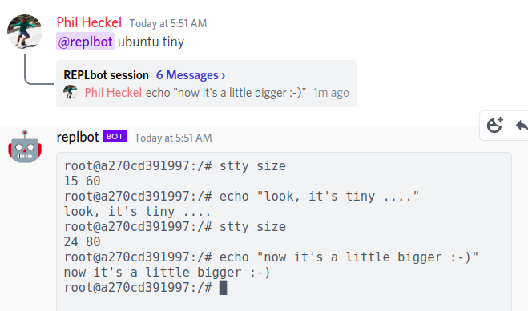

### Window mode
When starting a session, you can choose whether to trim empty space from the terminal session (`trim`), or 
whether to show the entire terminal window as it would appear in a terminal emulator (`full`). The default is `full`,
as `trim` mode can get awkward when the terminal is expanded and the collapsed again.

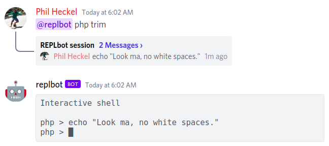

### Terminal sharing
You can share your local terminal window in Slack or Discord using the `share` feature. It's quite cool, although it's 
really got nothing to do with REPLs 🤷. It also has to be specifically configured in the [config.yml](config/config.yml) 
file using the `share-host` option, since it needs direct communication between the client and REPLbot.

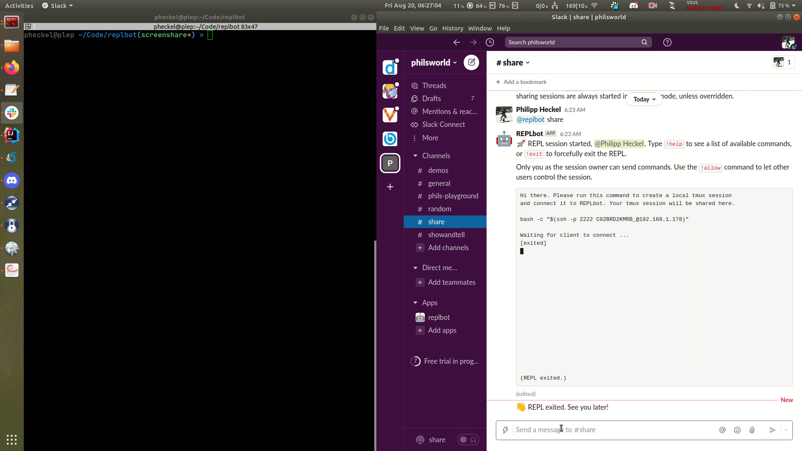

### Session commands
When a session is started, you can get a list of available commands by typing `!help` (or `!h`). To exit a session at any
point in time, type `!exit` (or `!q`).

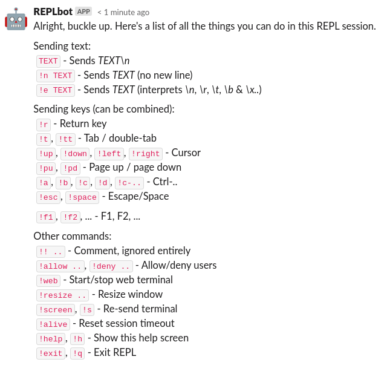

### Recording sessions
Sessions can be recorded using `asciinema`, and can even be automatically to either [asciinema.org](https://asciinema.org/)
or your private [asciinema-server](https://github.com/asciinema/asciinema-server) (see [install instructions](https://github.com/asciinema/asciinema-server/wiki/Installation-guide)).

After a session exits, the recording is then attached to chat as a ZIP file and optionally as a link to the asciinema server.
This behavior can be controlled by the `default-record` and `upload-recording` option in the [config.yml](config/config.yml)
file, as well as the `record`/`norecord` option when starting a session. 

Here's [the asciinema.org link](https://asciinema.org/a/MGsOv6CCVXiRtR8ZEd7MtFOTe) of the example
I recorded, as well as the [ZIP archive](assets/slack-recording.zip) with the recording.

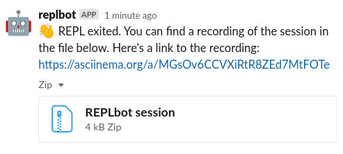

## Installation
First, create a Slack or Discord app and authorize it. After that, you can install REPLbot via packages or binaries.

**Requirements**:
- `tmux` >= 2.6 is required, which is part of Ubuntu 18.04 (but surprisingly not part of Amazon Linux!)
- `asciinema` if you'd like to record sessions
- `docker` for almost all scripts REPLbot shipts with

**Creating a REPLbot Slack app**:   
REPLbot requires a Slack "Classic App (bot)", because of its use of the real time messaging (RTM)
API. To create a classic app and acquire a Slack bot token, follow these steps:
1. Create a [classic Slack app](https://api.slack.com/apps?new_classic_app=1)
2. In the "App Home" section, add a "Legacy bot user"
3. In the "OAuth & Permissions" section, click "Install to Workspace" (_this may require workspace admin approval_)
4. Copy the "Bot User OAuth Token" starting with "xoxb-..."

**Creating a REPLbot Discord app**:   
1. Create a [Discord app](https://discord.com/developers/applications) 
2. In the "Bot" section, click "Add Bot" and disable "Public Bot"
3. In the "OAuth2" section, click "Add Redirect" and type a URL (even https://google.com is fine),
   select the scopes "bot" and "messages.read", and the permissions "public threads", "private thread",
   "send messages", "manage messages", "manage threads". Click "Save changes".
4. Copy the OAuth2 URL and navigate to it in the browser and authorize the app.
5. In the "Bot" section, copy the token and paste it here

**Installing `replbot`**:   
1. Make sure `tmux` and probably also `docker` are installed. Then install REPLbot using any of the methods below. 
2. Then edit `/etc/replbot/config.yml` to add Slack or Discord bot token. REPLbot will figure out which one is which based on the format.
3. Review the scripts in `/etc/replbot/script.d`, and make sure that you have Docker installed if you'd like to use them.
4. If you're running REPLbot as non-root user (such as when you install the deb/rpm), be sure to add the `replbot` user to the `docker` group: `sudo usermod -G docker -a replbot`.
5. Then just run it with `replbot` (or `systemctl start replbot` when using the deb/rpm).

### Binaries and packages
**Debian/Ubuntu** (*from a repository*)**:**
```bash
curl -sSL https://archive.heckel.io/apt/pubkey.txt | sudo apt-key add -
sudo apt install apt-transport-https
sudo sh -c "echo 'deb [arch=amd64] https://archive.heckel.io/apt debian main' > /etc/apt/sources.list.d/archive.heckel.io.list"  
sudo apt update
sudo apt install replbot
```

**Debian/Ubuntu** (*manual install*)**:**
```bash
sudo apt install tmux
wget https://github.com/binwiederhier/replbot/releases/download/v0.5.2/replbot_0.5.2_amd64.deb
dpkg -i replbot_0.5.2_amd64.deb
```

**Fedora/RHEL/CentOS:**
```bash
# Make sure that "tmux" is installed
rpm -ivh https://github.com/binwiederhier/replbot/releases/download/v0.5.2/replbot_0.5.2_amd64.rpm
```

**Docker:**   
You can configure the Docker image by mounting a config directory (containing [config.yml](config/config.yml)) to 
`/etc/replbot`. To be able to use most of the pre-packaged [script.d](config/script.d) REPLs (to be mounted to `/etc/replbot/script.d`), 
you'll need to give the REPLbot image access to the Docker socket file. This allows the container to spin up other containers 
on the host. This is a security risk and considered bad practice, but it's the only way.

```bash
docker run --rm -it \
  -v /etc/replbot:/etc/replbot \
  -v /var/run/docker.sock:/var/run/docker.sock \
  binwiederhier/replbot
```

**Go:**
```bash
# Be sure "tmux" is installed
go get -u heckel.io/replbot
```

**Manual install** (*any x86_64-based Linux*)**:**
```bash
# Make sure that "tmux" is installed
wget https://github.com/binwiederhier/replbot/releases/download/v0.5.2/replbot_0.5.2_linux_x86_64.tar.gz
sudo tar -C /usr/bin -zxf replbot_0.5.2_linux_x86_64.tar.gz replbot
```

## Building
Building replbot is simple. Here's how you do it:

```
make build-simple
# Builds to dist/replbot_linux_amd64/replbot
``` 

To build releases, I use [GoReleaser](https://goreleaser.com/). If you have that installed, you can run `make build` or
`make build-snapshot`.

## Contributing
I welcome any and all contributions. Just create a PR or an issue, or talk to me [on Slack](https://gophers.slack.com/archives/C02ABHKDCN7).

## License
Made with ❤️ by [Philipp C. Heckel](https://heckel.io), distributed under the [Apache License 2.0](LICENSE).

Third party libraries:
* [github.com/urfave/cli/v2](https://github.com/urfave/cli/v2) (MIT) is used to drive the CLI
* [discord-go](https://github.com/bwmarrin/discordgo) (BSD-3) is used for the Discord communication, specifically these two
  [these](https://github.com/bwmarrin/discordgo/pull/922) [two](https://github.com/bwmarrin/discordgo/pull/982) pull requests
  for thread support
* [slack-go](https://github.com/slack-go/slack) (BSD-2) is used for the Slack communication
* [gliderlabs/ssh](https://github.com/gliderlabs/ssh) (BSD-3) is used for remote port forwarding for terminal sharing

Code and posts that helped:
* [tmux sharing across hosts](https://gist.github.com/QuAzI/b6d29fd6239ed72c9c61870e7ee5ff90), thanks to [QuAzI](https://gist.github.com/QuAzI) 
